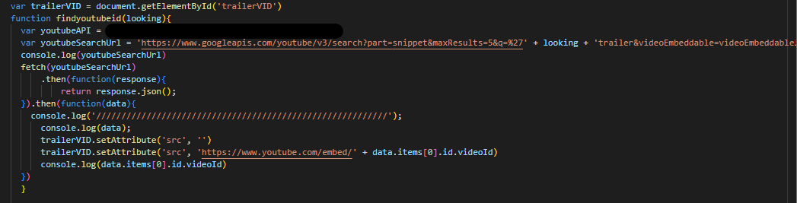
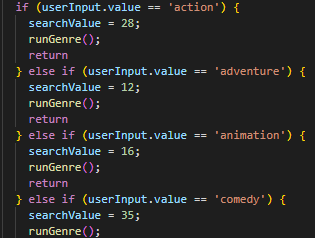

# MovieSuggestion-Proj1

## Deployment Link

<a href="https://fiaschettima.github.io/MovieSuggestion-Proj1">Click here to test this project</a>

## Description

 

Purpose:
Our app allows users to quickly and easily find new movies based off of title or genre. Users can also find similar movies to ones that pop up in their search to find movies they might enjoy based off of a previous movie they liked. Each movie option also has the ability to watch it's trailer so that they can easily screen results to find a movie they're interested in. Our app's UI is simple in order to maximize efficiency, with no unnecessary features making the app more difficult to learn at first glance. Users can also save movies to their favorites using local storage, so that they can easily come back to movies they were curious about from previous searches.

 Movie Suggester frees up some of the time spent searching for what to watch. With the plethora of movies that exist, our app takes the stress out of combing endlessly through lists, allowing users to find what to watch without needing to learn about how the site works or parsing through possible information about a movie like other sites offer.

The technologies used in the making of this project include HTML, CSS, JavaScript, server side API, our CSS framework Materialize, and our 3rd party APIs from The Movie Database and Youtube, as well as Github and Git. Skills used include

#### Here's a few quick links:

* [User Story](#user-story)
* [Code Snippets](#code-snippets)
* [Usage](#usage)
* [Technology used](#technology-used)
* [Credits](#credits)
* [License](#license)
* [Author](#authors)
---

## User Story

User Story: As a user I want to search for a movie and see a brief description and watch the trailer for the movie, so that I can decide if I want to watch the movie. 
 
User Story: As a user if I like the movie I want to be able to save it to come back to later, to compile a list of movies im interested in watching. 
 
User Story: As a user I want to be able to save movies so that I can view them later 
 
## Code Snippets

 
This is a short example of how the youtube API works, in our case we used the api to fetch the youtube video based on movie name. Then use the primary 
or first returned response to set the src of the iframe in the html. 
 
Small snippet showing how the user response was checked for matching genres, then converted to the genres id and later used to rune the API search with 
the genre id.

## Usage
To use this app, please click the link at the top of the page to first open the app in your browser.

Click on the search bar at the top of the page where you see the placeholder text "search movie" and type in either a title you would like to find or a genre you are interested in and click on the corresponding button (title for searching by title, genre for searching by genre). Please note that some genres are not supported as they do not exist in the TMDB API.

Next press enter or click the round "GO" button just below the search bar and see the page be populated with the results from the TMDB API.

From the movies that appear, click the one that you would like to know more about to see a brief overview appear over the poster image. You may also click on the "watch trailer" button to be presented with a modal displaying the trailer for the movie you have selected.

To find similar movies to the movie you've selected, simply press the "find similar" button on the card who's movie you would like to find similar movies to. This should automatically repopulate the page with movies similar to the one selected, while removing the previous movies searched.

To add a movie to your favorites, click the button with a star icon on the movie you would like to add to your favorites. You should see the star turn yellow. This movie will now appear if you click on the "Favorites" link at the very top of the page in our navigation bar. If you would like to remove a movie from your favorites, simply click the star button again and it should become transparent again. If you go back to your favorites, the movie you removed should no longer appear.

## Technology used

 
 
 
 
 
 
 
Skills used:
- new CSS framework (Materialize)
- using input validation to avoid errors and facilitate use for users, including using the lowercase method and resetting input value to match genre ids of the TMDB API
- local storage to add movies to an empty array using the dataset's keys to store favorites and populate the favorites page with specifically those movies 
- modal window that users can easily click out of to render trailers only when users deliberately click to do so
- clearing inner HTML at the beginning of our search function to reset movie cards generated so they don't endlessly stack
- integrates multiple 3rd-party APIs
- using web api to dynamically generate search results
- collaboration/ communication and branching/ merging (resolving conflicts, etc)
- HTML, CSS, JavaScript

## Credits
Credit goes to project contributors Matt Fiaschetti, Jeffery Zhu, and Damien Armstrong. Credit as well our CSS framework <a href="https://materializecss.com/">Materialize</a>, and the two APIs used, The Movie Database API and Youtube API.

## License

 
 
## Authors
Matt Fiaschetti: <a href="https://github.com/fiaschettima">Github Portfolio</a> 
Jeffrey Zhang: <a href="https://github.com/jeffz98">Github Portfolio</a> 
Damien Armstrong: <a href="https://github.com/pirosvs">Github Portfolio</a>